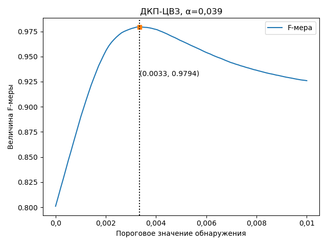
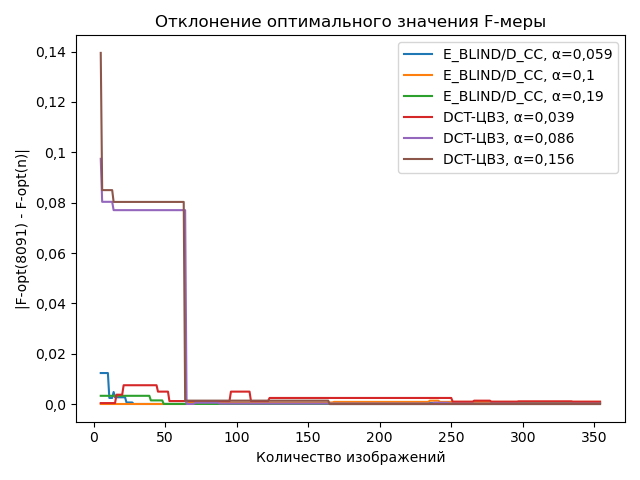

# Watermark Detection Threshold Selection

This repository contains Python scripts, a C++ implementation of watermarks, and evaluation results used in the article *"Selecting Detection Threshold for Correlation-Based Digital Watermarks Through F-Score Optimization."*

## Annotation
The proposed approach for selecting the detection threshold for digital watermarks utilizes correlation estimation at the detection stage. The method involves an algorithm for estimating the F-score to determine the optimal detection threshold using an image dataset. Finding the optimal detection threshold is achieved by optimizing the introduced F-score. The behavior of the F-score function is analyzed, enabling a reduction in the complexity of maximization. The effectiveness of various optimization algorithms for maximizing the F-score is compared, and the number of images sufficient to achieve reliable results is evaluated.

In the process of detecting digital watermarks using the correlation method, the tested image is classified as either containing or not containing a specific watermark. Thus, digital watermark detection is a binary image classification task. This allows the use of the F-score to evaluate the quality of watermark detection at different threshold values. To calculate the F-score based on the detection threshold, an experiment is conducted on a set of images that includes both images with embedded watermarks and images without them. The number and types of detection procedure triggers are then counted.

By iterating through threshold values, a graph of the F-score as a function of the detection threshold can be constructed. The figure below shows the results of calculating the F-score using the proposed method for 8,091 images from the Flickr8K database. The horizontal axis of the graph represents the detection threshold values tested during the computational experiment. The vertical axis represents the calculated F-score values, which range from 0 to 1. The red dots indicate the detected optimum of the F-score.

The graph below shows the deviation of detection threshold values found using F-score optimization methods on reduced image sets.

The horizontal axis represents the number of images used in the experiment, while the vertical axis shows the absolute difference between the detection threshold value calculated through F-score optimization using the number of images specified on the horizontal axis and the detection threshold value obtained through F-score optimization on the full set of 8,091 images.

## C++ Implementation of Watermarks Used in the Article
The article uses the following watermarks:

1) **E_BLIND/D_LC algorithm**, described in *"Cox I. et al. Digital Watermarking and Steganography" – Morgan Kaufmann, 2007.*
2) **DCT-based watermark**, described in *"Cox I. J. et al. Secure Spread Spectrum Watermarking for Multimedia," IEEE Transactions on Image Processing, 1997, Vol. 6, No. 12, pp. 1673-1687.*
3) **Another DCT-based watermark**, described in *"Barni M. et al. A DCT-Domain System for Robust Image Watermarking," Signal Processing, 1998, Vol. 66, No. 3, pp. 357-372.*

The source code for these C++ implementations is available in the `watermarks_implementation` directory, along with build instructions in `README.md`.

## Python Scripts
For working with watermarks, Python wrappers located in the `watermark` directory are used. You need to update the paths to executables in the scripts found in this directory.

- **`find_detect_threshold_calc_correlations.py`**: Calculates correlation values for the image database and stores results as a `.csv` file.
- **`detect_threshold_fixed_strength.py`**: Computes and stores F-scores for watermark detection thresholds at different embedding levels in a `.csv` file.
- **`find_detect_threshold_compare_images_cnt.py`**: Computes detection thresholds using F-score optimization for different numbers of images and stores results in a `.csv` file.
- **`plot_find_detect_threshold_compare_images_cnt.py`**: Visualizes the results of the above script.
- **`plot_detect_thresholds.py`**: Visualizes detection probabilities from a `.csv` file as a surface plot.
- **`plot_TP_FN_FP.py`**: Visualizes TP/FP/FN as functions of detection thresholds.

## Evaluated Results
Evaluated results are stored in the `results` directory as `.csv` files.
